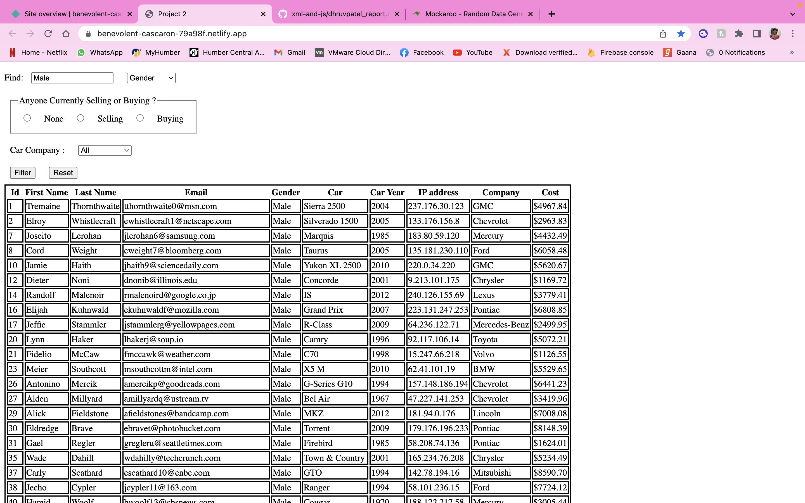
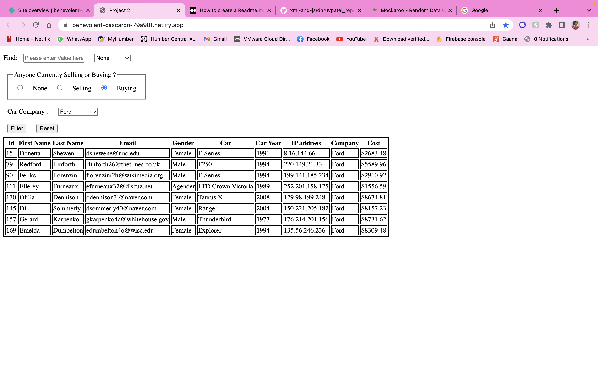
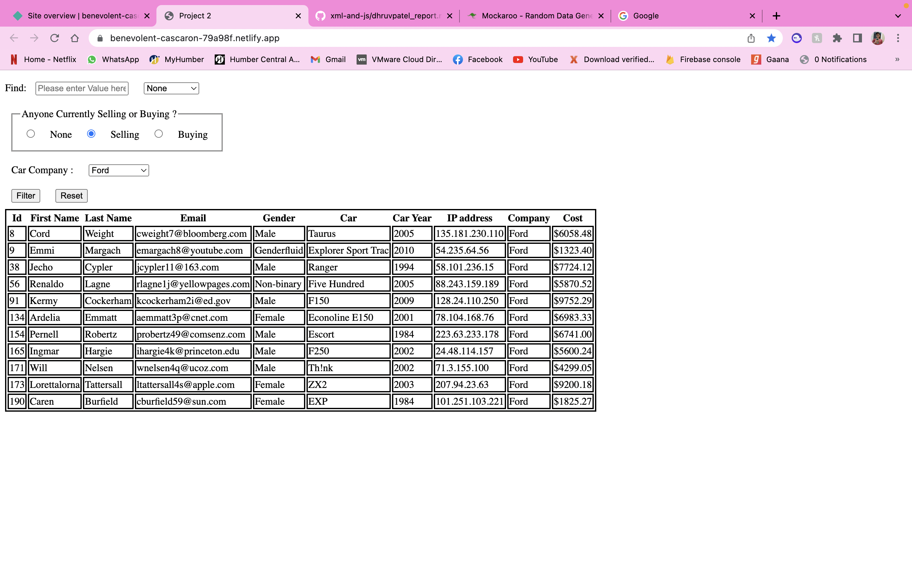
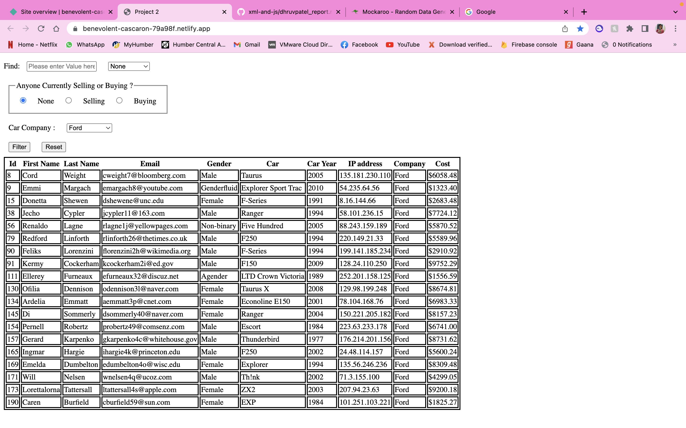
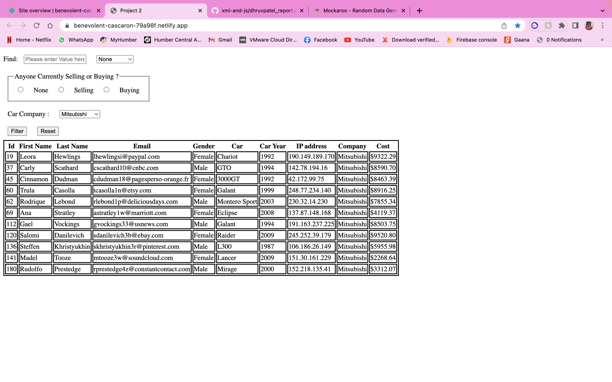

# Project 2

## Dhruv Vinodbhai Patel
## N01494614
## Buy or Sell Car Project

### Direct Link to visit my page : 
- https://benevolent-cascaron-79a98f.netlify.app/

### What is actually my Data is about and How my page is working ? 
- So First, I generate data or JSON file from https://www.mockaroo.com/ and got around 10 fields.
- Then, I have created HTML page where I print my table and the data and drop down menu, radio button and filter dropdown menu
- Then I have linked this file with my Dealer function js file.
- Where I am mapping my json data into table and make functionality to perform my 3 different characteristics as shown below
    - Filter by using any field (e.g Id, firstname, lastname etc).
    - Filter by using radio button where we can see who is selling or buying the car of any model.
    - Filter by Car brand

### 3 Types of Filters I have used.
#### Filter by using any field
- we have None, id, Firstname, Lastname, Email, Gender, Car , Car Year and IP Address.
- So user can search by any of the above field by giving value in textbox shown as below.

#### Filter by using radio button
- Here, I have taken 3 fields, (None, Selling or Buying)
- So, basically if someone wants to check buying price for specific car (e.g Ford) so they can filter by clicking on "Buying" radio button like shown as below.

- If someone wants to check selling price for specific car so they can filter by clicking on "Selling" radio button shown as below.

- Or if we choose none then it will display every details without filtering it.

#### Filter by using car brand or ALL

- If someone wants to search by using car brand they can use this filter and it will filter by car models.

